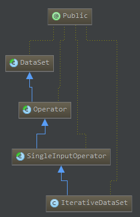

[TOC]


# DataSet API 中的Iterate使用

Flink 内核的Iterate的实现非常复杂，涉及到计划生成、优化等多个过程，因此如果继续往下分析其实现可能需要耗费大量的时间，因此按下不表，以后有时间再补充，本章节重点讲述DataSet API 中的 Iterate 的使用规则。

Flink提供了两种迭代模式：BulkIteration和DeltaIteration，分别对应在DataSet_Iteration_Implements章节中Iterator 和 DeltaIterator。

## Bulk Iterations

我们采用Bulk Iteration方式来估算圆周率，如下代码所示。使用*DataSet.iterate(int maxIteration)*可以获取一个*IterativeDataSet*, 这个数据集的继承关系如图1所示，由此可见，IterativeDataSet本质上是一个DataSet,因此可以使用通用的操作在其上进行转换。唯一传入的参数是最大迭代次数。

*IterativeDataSet.closeWith(DataSet)*方法用来指定迭代过程中的Step Function.即每次迭代时，数据集上的数据应该如何进行转换。此外还有IterativeDataSet.closeWith(DataSet,DataSet)方法，该方法中第二个参数DataSet用来判断何时终止迭代-当第二个数据集为空时，停止迭代。如果用户没有显式的给出第二个数据集，则当迭代达到最大次数时停止迭代。

```java
//initial the dataset.
IterativeDataSet<Integer> initial = env.fromElements(0).iterate(10000);

//define the step function.
DataSet<Integer> iteration = initial.map(new MapFunction<Integer, Integer>() {
  public Integer map(Integer value) throws Exception {
    double x = Math.random();
    double y = Math.random();

    return value + (( x * x + y * y < 1 ) ? 1 : 0);
  }
});

// Iteratively transform the IterativeDataSet
DataSet<Integer> count = initial.closeWith(iteration);

count.map(new MapFunction<Integer, Double>() {
  public Double map(Integer count) throws Exception {
    return count / (double) 10000 * 4;
  }
}).print();
```

下图给出了IterativeDataSet的类图，它继承自SingleInputOperator,正如这个名字所示，SingleInputOperator只有一个输入，如map,reduce这样的操作都是SingleInputOperator。SingleInputOperator又是DataSet的子类，本质上这个操作是DataSet类型的，是在批上进行的转换。



使用的规则是：

1. 使用*DataSet.iterate(int maxIteration)*方法获取*IterativeDataSet*对象；
2. 在*IterativeDataSet*对象上定义Step Function，即定义常见的诸如map,reduce等这样的操作，这些操作将返回DataSet类型的对象；
3. 在*IterativeDataSet*对象上调用*closeWith(DataSet)*方法；

如下所述，是Flink 1.1.3版本中IterativeDataSet类的两个非常重要的方法的描述。可见closeWith(DataSet)传入的参数其实就是在Next Partial Solution，即上一次的迭代计算结果作为下一次的输入。而该方法返回的DataSet是迭代计算终止后的最终计算结果。对于<u>closeWith(DataSet,DataSet)</u>方法，还没有尝试成功。

```java
/**
 * Closes the iteration. This method defines the end of the iterative program part.
 * 
 * @param iterationResult The data set that will be fed back to the next iteration.
 * @return The DataSet that represents the result of the iteration, after the computation has terminated.
 * 
 * @see DataSet#iterate(int)
 */
public DataSet<T> closeWith(DataSet<T> iterationResult) {
   return new BulkIterationResultSet<T>(getExecutionEnvironment(), getType(), this, iterationResult);
}

/**
 * Closes the iteration and specifies a termination criterion. This method defines the end of
 * the iterative program part.
 * <p>
 * The termination criterion is a means of dynamically signaling the iteration to halt. It is expressed via a data
 * set that will trigger to halt the loop as soon as the data set is empty. A typical way of using the termination
 * criterion is to have a filter that filters out all elements that are considered non-converged. As soon as no more
 * such elements exist, the iteration finishes.
 *
 * @param iterationResult The data set that will be fed back to the next iteration.
 * @param terminationCriterion The data set that being used to trigger halt on operation once it is empty.
 * @return The DataSet that represents the result of the iteration, after the computation has terminated.
 * 
 * @see DataSet#iterate(int)
 */
public DataSet<T> closeWith(DataSet<T> iterationResult, DataSet<?> terminationCriterion) {
   return new BulkIterationResultSet<T>(getExecutionEnvironment(), getType(), this, iterationResult, terminationCriterion);
}
```

## Delta Iterations

增量迭代相比整体迭代不同，增量迭代是假设在迭代过程中，不是所有的元素都会发生改变。

在每一轮的迭代过程中，不仅部分的结果集会被反馈回来，而且增量迭代在迭代过程中会去维护这个结果集(solution set)，而且这个结果集可以以增量的形式进行更新。

定义一个增量迭代和定义一个整体迭代相似。不同之处在于增量迭代在每一轮的迭代过程中需要输入两个数据集：工作集(work set)和结果集(solution set)，这两个数据集也是本次迭代结束之后产生的结果。

可以使用*DataSet.iterateDelta(DataSet,int,int)*或者*DataSet.iterateDelta(DataSet,int,int[])*方法来创建增量迭代。这个方法是运行在结果集上，其中传入的参数是初始的delta set,最大迭代次数和key positions.这个方法返回的*DeltaIteration*对象提供的*iteration.getWorkset()*和*iteration.getSolutionSet()*这两个方法能够使得用户获取对应的工作集和结果集。demo如下所示：

```java
// read the initial data sets
DataSet<Tuple2<Long, Double>> initialSolutionSet = // [...]

DataSet<Tuple2<Long, Double>> initialDeltaSet = // [...]

int maxIterations = 100;
int keyPosition = 0;

DeltaIteration<Tuple2<Long, Double>, Tuple2<Long, Double>> iteration = initialSolutionSet
    .iterateDelta(initialDeltaSet, maxIterations, keyPosition);

DataSet<Tuple2<Long, Double>> candidateUpdates = iteration.getWorkset()
    .groupBy(1)
    .reduceGroup(new ComputeCandidateChanges());

DataSet<Tuple2<Long, Double>> deltas = candidateUpdates
    .join(iteration.getSolutionSet())
    .where(0)
    .equalTo(0)
    .with(new CompareChangesToCurrent());

DataSet<Tuple2<Long, Double>> nextWorkset = deltas
    .filter(new FilterByThreshold());

iteration.closeWith(deltas, nextWorkset)
	.writeAsCsv(outputPath);
```

DeltaIteration类直接继承自Object,类似BulkIteration，有一个closeWith()方法：

```java
// --------------------------------------------------------------------------------------------

/**
 * Closes the delta iteration. This method defines the end of the delta iteration's function.
 * 
 * @param solutionSetDelta The delta for the solution set. The delta will be merged into the solution set at the end of
 *                         each iteration.
 * @param newWorkset The new workset (feedback data set) that will be fed back to the next iteration.
 * @return The DataSet that represents the result of the iteration, after the computation has terminated.
 * 
 * @see DataSet#iterateDelta(DataSet, int, int...)
 */
public DataSet<ST> closeWith(DataSet<ST> solutionSetDelta, DataSet<WT> newWorkset) {
   return new DeltaIterationResultSet<ST, WT>(initialSolutionSet.getExecutionEnvironment(),
         initialSolutionSet.getType(), initialWorkset.getType(), this, solutionSetDelta, newWorkset, keys, maxIterations);
}
```

