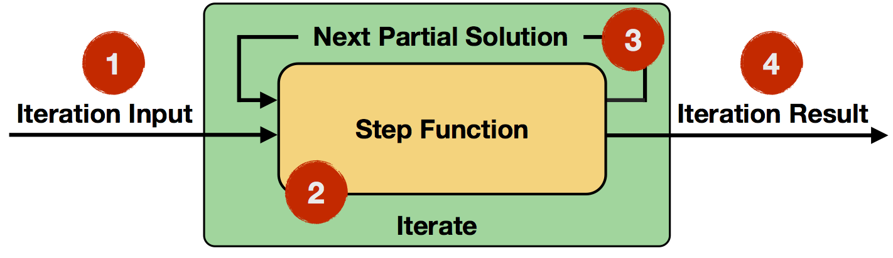
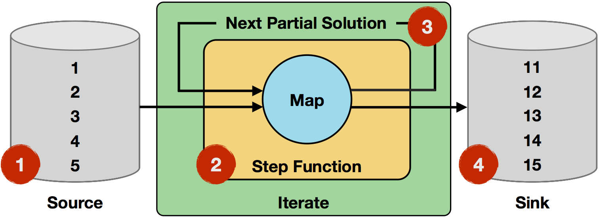
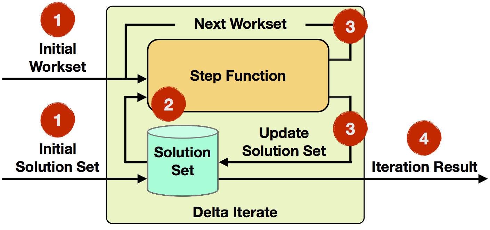

[TOC]

# Iteration

迭代计算在诸如机器学习、图计算等数据分析领域使用广泛。Flink程序通过将*step function*其嵌入一个特定的迭代操作来实现迭代算法。Flink提供了两种迭代操作：*Iterate*和*DeltaIterate*，这两种迭代操作都是通过在当前的迭代状态下反复的调用*step function*，直到到达终止条件。

下表列出了这两种迭代模型的特性：

|                      | Iterate                                  | Delta Iterate                            |
| :------------------- | ---------------------------------------- | ---------------------------------------- |
| **Iteration Input**  | Partial Solution                         | Workset & Solution Set                   |
| **Step Function**    | Arbitrary Data Flows                     | Arbitrary Data Flows                     |
| **State Update**     | Next **partial solution**                | Next workset    **Changes to solution set** |
| **Iteration Result** | Last partial solution                    | Solution set state after last iteration  |
| **Termination**      | **Maximum number of iterations** (default)  Custom aggregator convergence | **Maximum number of iterations or empty workset** (default)  Custom aggregator convergence |

## Iterate Operator ##



如上图所示，是迭代操作的计算过程：

1. **Iteration Input**: 迭代操作的输入数据，数据源或者前一个操作的结果都可以作为迭代操作的初始数据。
2. **Step Function: ** 每次迭代过程中执行的函数。他可以是任意的数据转换操作，如*map,reduce,join*等，这就是你需要提供的核心的任务逻辑。
3. **Next Partial Solution:**在每次迭代中，Step Function的输出将会作为下次迭代的输入，此过程中Step Function的输出即为Next Partial Solution.
4. **Iteration Result:**最后一次的迭代结果即为最终的迭代结果。这个迭代结果可以写入到data sink，或者作为中间数据提供给下游的算子。

这里有多种方式可以设置迭代终结条件：

- **最大迭代次数：**最多允许的迭代次数。
- **用户自定义的聚合收敛标准：**迭代允许自定义聚合函数和收敛标准，如在求所有记录的数量的时候，如果为0则迭代结束。

你可以认为迭代操作的伪代码如下：

```
IterationState state = getInitialState();

while (!terminationCriterion()) {
	state = step(state);
}

setFinalState(state);
```


## Example: Incrementing Numbers ##

在如下的操作中，我们以迭代的方式增长集合中的元素值：



1. **Iteration Input:** 最开始的数据是一个包含1,2,3,4,5这5条记录的数据源。

2. **Step Function:** Step Function 是一个map 操作，将原来的数值+1。这个操作将会映射到每个记录上。

3. **Next Partial Solution:** Step Function的输出结果，即将原来的值各自+1之后的结果。

4. **Iteration Result:** 在10轮迭代结束后，集合中所有的值在原来的基础上都增加了10.

   ​

   // 1st				2nd			...		10th

   map(1) -> 2		map(2) -> 3		...		map(10) -> 11

   map(2) -> 3		map(3) -> 4		...		map(11) -> 12

   map(3) -> 4		map(4) -> 5		...		map(12) -> 13

   map(4) -> 5		map(5) -> 6		...		map(13) -> 14

   map(5) -> 6		map(6) -> 7		...		map(14) -> 15


## Delta Iterate Operator ##

delta迭代运算符涵盖**增量迭代**的情况。增量迭代**有选择地**修改其解决方案的元素，并演化解决方案，而不是完全重新计算它。

这里有两个非常重要的概念：work set & solution set.

**work set**(工作集)：工作节点的集合。只有工作集中的节点才参与下一次迭代的运算。因此在每次的迭代过程中，工作集可能会越来越小直至为空，当工作集为空时，算法停止迭代。

**solution set**(结果集)：迭代结果的集合。结果集是能够直接反馈算法的最终计算结果。随着每次迭代的进行，结果集中的元素可能会被不断的更新，最后一次的迭代的结果，将作为整个算法的最终迭代结果。

在实用情况下，这将使得算法计算更加高效（更快的收敛），因为在每次迭代过程中，结果集（solution set）中不是所有的元素都会发生改变。这将允许问题域集中在热点数据（hot parts）上，并且不去改变哪些冷点数据（cold parts）。若干次迭代之后，结果集中的大部分数据都会慢慢冷却，相比较上次的迭代操作，此次迭代只会在很小的数据集上进行运算。

1. **Iteration Input:** 初始化的workset 和 solution set是从数据源或者上一次操作的数据作为初始数据。
2. **Step Function:** 每次迭代过程中执行的函数。他可以是任意的数据转换操作，如*map,reduce,join*等，这就是你需要定义的核心的任务逻辑。
3. **Next Workset/Update Solution Set:** Next Workset驱动迭代计算，并且反馈给下一次的迭代中。此外，Solution Set 将会被更新和隐式的转发（不需要被重建）。这两个数据集可以被Step Function的不同操作更新。
4. **Iteration Result:** 在最后一次迭代之后，工作集（solution set）会被写到data sink或者作为下游算子的输入。


delta iteration 的默认终止条件是当work set为空时或者达到最大迭代次数。或者也可以通过指定一个**custom aggregator**和收敛准则（**convergence criterion**）。

Delta Iteration的迭代过程如下图所示：

```
IterationState workset = getInitialState();
IterationState solution = getInitialSolution();

while (!terminationCriterion()) {
	(delta, workset) = step(workset, solution);

	solution.update(delta)
}

setFinalState(solution);
```


## Example: Propagate Minimum in Graph

在如下的示例中，每个顶点都有一个ID号和一个颜色。每个顶点都会将自己的ID号传给邻接点，目标是将子图中的所有顶点都赋值为最小的ID号。如果接收的ID号小于自己当前的ID号，则更新当前顶点的颜色为所接收的ID号对应的颜色。这歌算法在社区分析和连通子图中使用。


初始输入（Initial input）将被作为初始的工作集和结果集。在上图中，节点的颜色变化形象的展示了solution set的变化过程。在每一次的迭代过程中，最小ID号的节点的颜色在子图中传播，与此同时，工作节点的数量也在逐步减少。从最开始的7个节点减少到最后一次迭代时的0个节点。当工作集为空时，迭代结束。

在上半部的子图中，ID 为1的节点（颜色为橘色）是最小ID号节点。在第一次迭代时，它将其值传给ID为2的节点，这将使得ID为2的节点的颜色改变成为橘色。节点3和4将会收到节点2（黄色）传来的颜色并且将自身的颜色改变成黄色。因为节点1在第一次的迭代过程中没有改变颜色，所以在下一次的工作集中它将被剔除掉。

在下半部的子图中，节点5是最小节点。所有的节点都会在第一次迭代的时候收到节点5传过来的值，同理，节点5本身并没有改变，所以在下一次迭代时将其从工作集中删掉。

综上所述，在第二次迭代时，工作集从原来的7个元素减少至5个元素（2,3,4,6,7）。接下来的迭代过程以此类推。直到第三次迭代时，工作集为空，计算结束。


## Superstep Synchronization ##

一次迭代操作中的step function的执行作为一个单独的迭代，则在并行场景下，我们将step function的设置成多个实例，在迭代状态的不同分区中并行执行。通常将step function的所有的并行实例形成的整体成为一个superstep，同时这也是同步的粒度。因此，一个迭代中的所有的并行的任务必须全部执行完后，下一个超步才能够被初始化。终止条件也将在超步的栅栏中进行评估。

