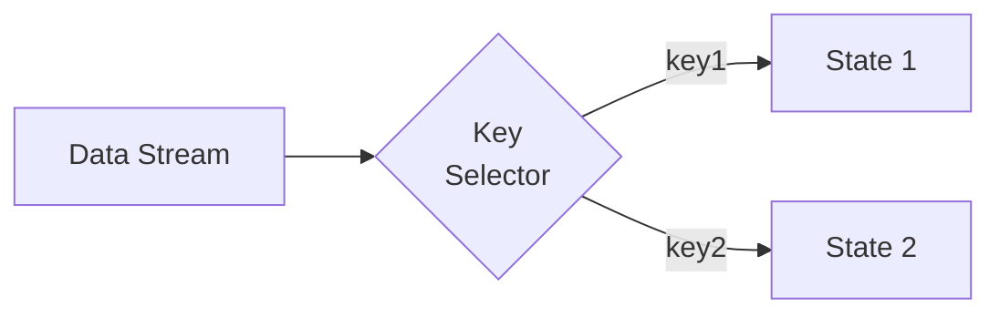
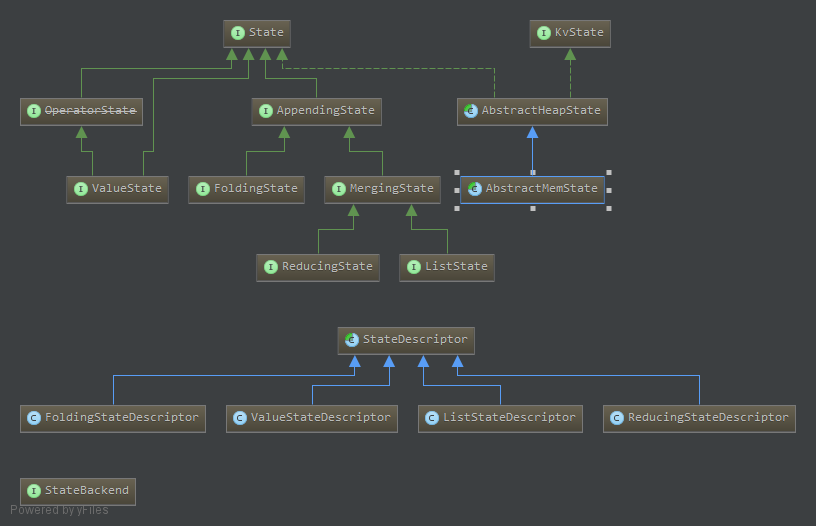

[TOC]

[原文链接](https://ci.apache.org/projects/flink/flink-docs-release-1.2/dev/stream/state.html)

# Working with State

在Flink中，有状态的函数或者操作能够在处理数据或事件的同时，存储数据。状态可以成为设计较为复杂的操作中重要的一环。例如：

+ 当一个程序希望找到事件的pattern时，状态可以用来存储截止到目前为止已经出现的pattern。
+ 当希望每一分钟做一次聚合操作时，状态可以用来存储聚合操作的中间值。
+ 当在数据流上做机器学习训练模型时，状态能够用来存储当前的训练参数。

诸如此类，可见状态在较为复杂的情景中使用广泛。同时为了保证状态的可恢复特性，Flink需要感知状态(state)及检查点(checkpoint)。在大多数情景中，Flink能够管理这些状态，即使状态足够大，Flink也可以采用内存存储或者写磁盘的方式优雅的管理这些状态信息。

在Flink之前的版本，状态可以分为两种：**Keyed State**和**Operator State**。

## Keyed State

​      Keyed State 通常是和key关联，而且只能用在*KeyedStream*流上。你可以认为Keyed State是Operator State分区之后的结果，即Operator State通过key分区之后对应的state即为Keyed State。说白了就是Keyed State是跟具体的key对应的。每一个keyed-state都是一个< parallel-operator-instance , key >对，又因为可以key只可能属于并行实例中的一个keyed operator,所以我们可以简化为< operator , key >对形式。可以用如下的流程来说明Keyed State，对于一个*DataStream*,经过*KeySelector*分流之后，形成*key1*和*key2*两个流，这两个流都有对应的状态*state1*和*state2*，可以在这两个流上去获取和修改对应的状态。

那么一个操作可能有多个分片的state,这些state又被一个Key Groups来组织。Key Groups是Flink能够重新分配的Keyed State的最小单元。而且Key Group的数量和系统的最大并行度一致。

## Using Managed Keyed State

​      再次提醒Keyed State只能用在KeyedStream上。详细的**State**接口以及**StateDescriptor**接口类图如下图所示(基于Flink1.1.3)。

- `ValueState<T>`:  一对一的状态，即一个Key对应一个ValueState，可以通过*value() / update(T)*存取。
- `ListState<T>`: 一个key对应一个列表。可以通过*add(T) / Iterable<T> get()*方式来存取该列表。
- `ReducingState<T>`：按照用户指定的*ReduceFunction*,对用户通过*add(T)*添加进入的元素进行reduce，最终形成一个元素。
- `FoldingState<T, ACC>`：类似ReducingState，只是通过*FoldFunction*进行聚合。
- `MapState<UK, UV>`：<u>这个API不存在？？</u>

​        那么这些State如何使用呢？State**必须搭配**StateDescriptor**使用，为State创建一个对应的StateDescriptor，来描述State的名字(这个名字必须是唯一的)，类型和初始值，然后使用**RuntimeContext**来获取这个state，获取函数如下所示：

- `ValueState<T> getState(ValueStateDescriptor<T>)`
- `ReducingState<T> getReducingState(ReducingStateDescriptor<T>)`
- `ListState<T> getListState(ListStateDescriptor<T>)`
- `FoldingState<T, ACC> getFoldingState(FoldingStateDescriptor<T, ACC>)`
- `MapState<UK, UV> getMapState(MapStateDescriptor<UK, UV>)`

`pay attention:` 对于OperatorState跟checkpoint相关，不是本项目相关的核心内容。因此不再细讨论。而且关于State的核心实现包在flink-runtime包的org.apache.flink.runtime.state下，可以自行浏览。
